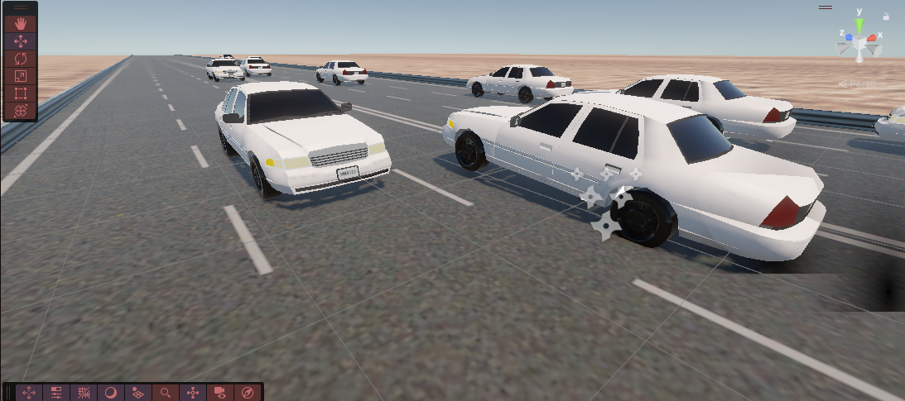

## Uploading a Unity Project to GitHub

Follow these steps to add your Unity project to a GitHub repository.

### 1. Prepare Your Project
- Make sure your Unity project is working and all files are saved.
- Create a `.gitignore` file in the project root to avoid uploading unnecessary files like `Library/` or `Temp/`.  
  You can use the [Unity .gitignore template](https://github.com/github/gitignore/blob/main/Unity.gitignore).

> Important folders to exclude: `Library/`, `Temp/`, `Logs/`, `Obj/`, `Build/`.

---

### 2. Initialize Git

#### Using GitHub Desktop
1. Open **GitHub Desktop**.
2. Click **File → Add Local Repository → Choose your Unity project folder**.
3. Click **Create Repository**.
4. Ensure your `.gitignore` is in place.
5. Add a commit message (e.g., "Initial commit") and click **Commit to main**.
6. Click **Publish repository** to push your project to GitHub.

#### Using Command Line
1. Open a terminal in your project folder.
2. Run the following commands:

```bash
git init
git add .
git commit -m "Initial commit"
git branch -M main
git remote add origin https://github.com/USERNAME/REPO_NAME.git
git push -u origin main




